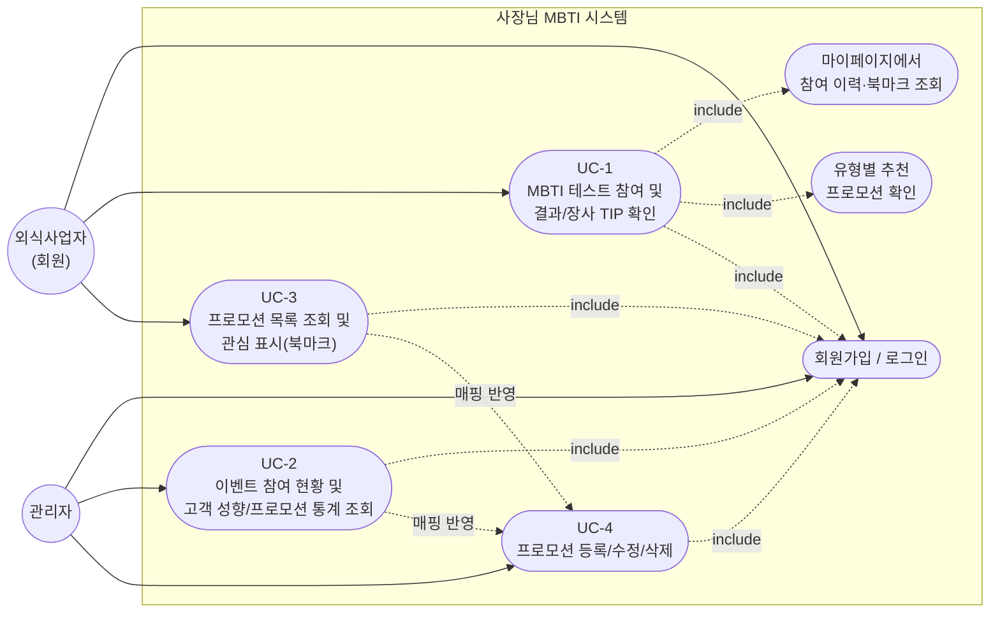

# 사장님 MBTI 유스케이스 다이어그램

`docs/1-domain-definition.md`의 6. 주요 유스케이스(UC-1~UC-4) 및 3. 핵심 액터를 기준으로 작성.

## 유스케이스 요약

| ID | 액터 | 설명 |
|---|---|---|
| UC-0 | 외식사업자, 관리자 | 회원가입 및 로그인 (모든 기능의 선행 조건) |
| UC-1 | 외식사업자 | MBTI 테스트 참여 → 결과/장사 TIP 및 유형별 추천 프로모션 확인, 결과는 마이페이지에서 재조회 가능 |
| UC-2 | 관리자 | 전체 참여자 수, 유형별/성향 지표별 참여 현황, 프로모션별 추천 매칭 수·북마크 수 통계 조회 |
| UC-3 | 외식사업자 | 이벤트/프로모션 전체 목록 조회(추천 정렬·인기 TOP3·신규/마감임박 뱃지·유형별 필터) 및 관심 표시(북마크) |
| UC-4 | 관리자 | 프로모션 등록/수정/삭제 및 MBTI 유형 매핑 관리 — 결과가 UC-1/UC-3에 즉시 반영됨 |

상세 흐름, 예외 케이스, 비즈니스 규칙은 `docs/1-domain-definition.md`의 6~8절 참조.

## 변경 이력

| 버전 | 날짜 | 변경 내용 |
|---|---|---|
| v1.0 | 2026-08-13 | 초안 작성 |
| v1.1 | 2026-08-20 | UC-3(프로모션 목록/북마크), UC-4(관리자 프로모션 관리) 추가, UC-2에 프로모션 통계 반영 |
| v1.2 | 2026-08-20 | UC-3 요약에 유형별 필터 기능 반영(도메인 정의서 v1.7과 정합) |
