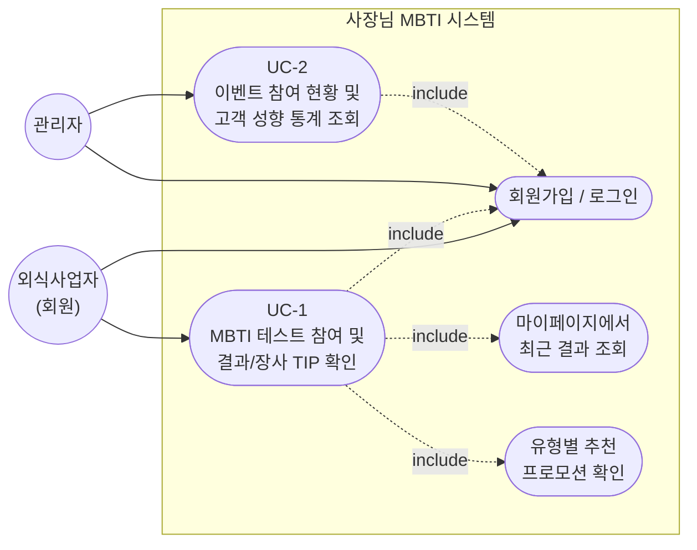

# 사장님 MBTI 유스케이스 다이어그램

`docs/1-domain-definition.md`의 6. 주요 유스케이스(UC-1, UC-2) 및 3. 핵심 액터를 기준으로 작성.

## 유스케이스 요약

| ID | 액터 | 설명 |
|---|---|---|
| UC-0 | 외식사업자, 관리자 | 회원가입 및 로그인 (모든 기능의 선행 조건) |
| UC-1 | 외식사업자 | MBTI 테스트 참여 → 결과/장사 TIP 및 유형별 추천 프로모션 확인, 결과는 마이페이지에서 재조회 가능 |
| UC-2 | 관리자 | 전체 참여자 수, 유형별/성향 지표별 참여 현황 통계 조회 |

상세 흐름, 예외 케이스, 비즈니스 규칙은 `docs/1-domain-definition.md`의 6~8절 참조.
