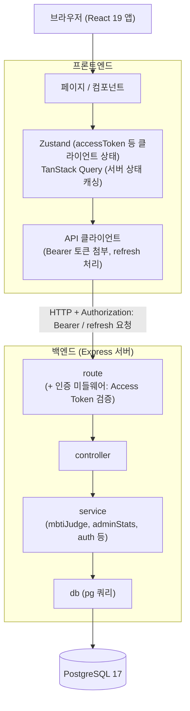
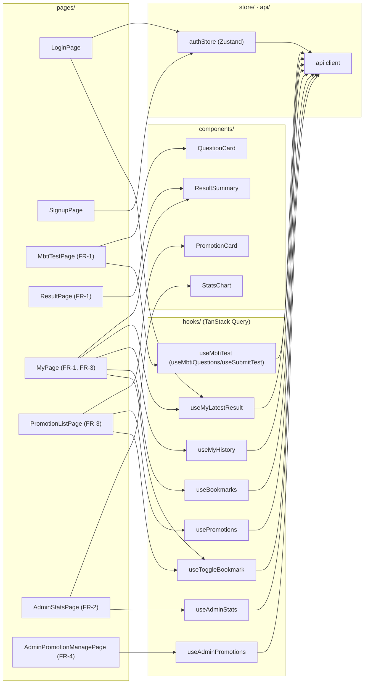

# 사장님 MBTI 기술 아키텍처 다이어그램

> 참고 문서: [`docs/3-PRD.md`](./3-PRD.md) (기술 스택), [`docs/5-project-principle.md`](./5-project-principle.md) (레이어 구조/디렉토리 구조)

교육용 MVP(1인 개발, 3일 일정) 특성상 로드밸런서/캐시/큐/CDN 등은 도입하지 않고, PRD·구조 원칙 문서에 명시된 스택만으로 구성한다.

## 아키텍처 개요

## 프론트엔드 컴포넌트 구조

`docs/5-project-principle.md` 6절 디렉토리 구조 기준, 페이지(Page)가 어떤 컴포넌트/훅/스토어를 사용하는지 표현한다.

## 구성 요소 설명

| 구성 요소 | 설명 |
|---|---|
| 브라우저 (React 19 앱) | 반응형 웹 UI, 모바일 테스트 참여/데스크탑 관리자 통계 조회 |
| 페이지 / 컴포넌트 | 화면 렌더링만 담당, 상태 로직 없음 |
| Zustand | 클라이언트 전역 상태(로그인 여부, Access Token) 전용 |
| TanStack Query | 서버 상태(질문 목록, 결과, 통계) 캐싱/재조회 전용 |
| API 클라이언트 | 컴포넌트가 직접 호출하지 않고 이 계층을 통해서만 백엔드와 통신, Access Token 첨부 및 만료 시 Refresh 처리 |
| route (+ 인증 미들웨어) | URL/HTTP 메서드 정의, `requireAuth`에서 Access Token 검증 |
| controller | req/res 파싱 및 service 호출, 비즈니스 로직 없음 |
| service | MBTI 판정, 통계 집계, JWT 발급/검증 등 실제 비즈니스 로직 |
| db | pg 쿼리 실행 (SQL은 이 계층에만 존재) |
| PostgreSQL 17 | User, MbtiQuestion, MbtiResultType, PromotionOffer, TestSubmission, Bookmark 저장 |

Refresh Token은 서버 DB에 저장하지 않고 stateless로 검증하며(`POST /api/auth/refresh`), 이 흐름도 API 클라이언트 ↔ route 사이에서 처리된다.

## 변경 이력

| 버전 | 날짜 | 변경 내용 |
|---|---|---|
| v1.0 | 2026-08-13 | 초안 작성 |
| v1.1 | 2026-08-13 | 프론트엔드 컴포넌트 구조 다이어그램 추가 |
| v1.2 | 2026-08-20 | 지속 재방문 강화 기획(FR-3/FR-4) 반영: PromotionListPage, AdminPromotionManagePage, PromotionCard, usePromotions/useBookmarks/useMyHistory/useAdminPromotions 훅을 컴포넌트 구조 다이어그램에 추가 |
| v1.3 | 2026-08-20 | 실제 구현과 정합성 검토 반영: `useMbtiQuestions`/`useSubmitTest`를 실제 파일 기준 `useMbtiTest` 1개로 정정, `useToggleBookmark` 노드 추가(MyPage/PromotionListPage에서 사용), 로그인 후 목적지 분기용 `LoginPage → useMyLatestResult` 엣지 추가 |
