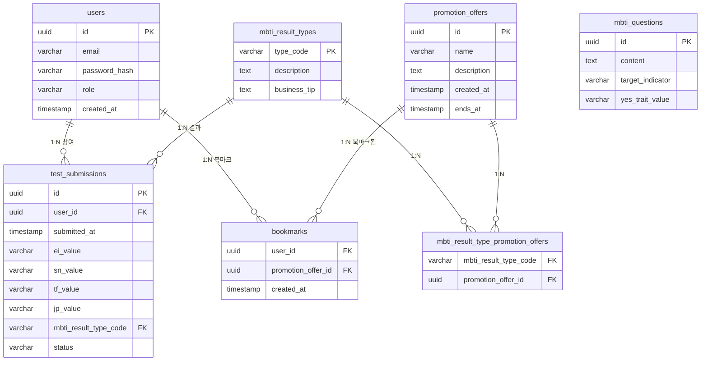

# 사장님 MBTI ERD

> 참고 문서: [1-domain-definition.md](./1-domain-definition.md) (도메인 정의서 v1.6, 4절/5절), [3-PRD.md](./3-PRD.md) (PRD v1.5, 6절 기술 스택: PostgreSQL 17, JWT Access/Refresh Token)

## ERD

## 테이블 설명

- **users**: 회원 계정. `role`은 USER/ADMIN (varchar + check 제약으로 표현, MVP 규모상 별도 enum 타입 생략). 도메인 정의서 4절 User 그대로.
- **mbti_questions**: 예/아니오 문항. `target_indicator`는 E/I, S/N, T/F, J/P 중 하나, `yes_trait_value`는 "예" 응답 시 판정되는 성향값. 지표당 3문항, 총 12문항(도메인 정의서 4절 그대로, TestSubmission과 직접 FK 관계 없음).
- **mbti_result_types**: 16개 유형 참조 데이터. `type_code`(예: ENTJ)를 PK로 사용해 FK 조인 시 코드 자체로 참조 가능하게 함(도메인 정의서 4절 그대로).
- **promotion_offers**: 이벤트/프로모션(표시 전용, 실제 쿠폰 발급 없음). v1.6부터 관리자가 CRUD로 직접 운영하며, `created_at`(등록일, "신규" 뱃지 판단용)과 `ends_at`(마감일, NULL이면 상시 프로모션, "마감임박" 뱃지 판단용)을 추가(도메인 정의서 4절 v1.6 참조).
- **mbti_result_type_promotion_offers**: `mbti_result_types` N:N `promotion_offers` 관계를 표현하기 위한 조인 테이블. 도메인 정의서 5절에 N:N 관계로만 명시되어 있고 관계형 DB(PostgreSQL)에서는 조인 테이블 없이 N:N을 표현할 수 없으므로 추가함(PK는 두 FK 컬럼의 복합키).
- **test_submissions**: 테스트 참여 이력. 도메인 정의서 5절에 따라 문항별 답변 로그는 저장하지 않고 4개 지표 최종값(`ei_value`, `sn_value`, `tf_value`, `jp_value`)과 `mbti_result_type_code`, `status`(COMPLETED/IN_PROGRESS)만 저장. 도메인 정의서 4절 그대로.
- **bookmarks**: `users` N:N `promotion_offers` 관계를 표현하는 조인 테이블 겸 Bookmark 엔티티(도메인 정의서 4절 v1.6 신규). PK는 `(user_id, promotion_offer_id)` 복합키 — 이력이 아닌 현재 상태만 의미가 있으므로 동일 조합은 유일해야 함(북마크 해제 시 행 자체를 삭제, 별도 상태 컬럼 없음).

## 변경 이력

| 버전 | 날짜/시간 | 변경 내용 |
|---|---|---|
| v1.0 | 2026-08-13 | 초안 작성 |
| v1.1 | 2026-08-20 | 지속 재방문 강화 기획(v1.6 도메인 정의서) 반영: `promotion_offers`에 `created_at`/`ends_at` 추가, `bookmarks` 테이블 신설(users N:N promotion_offers) |
